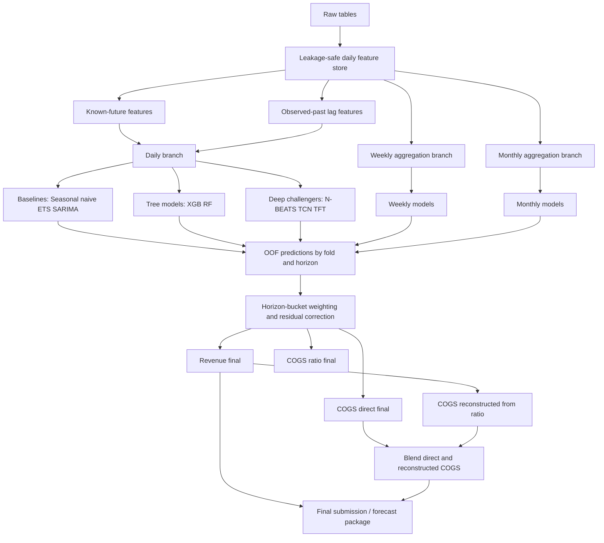
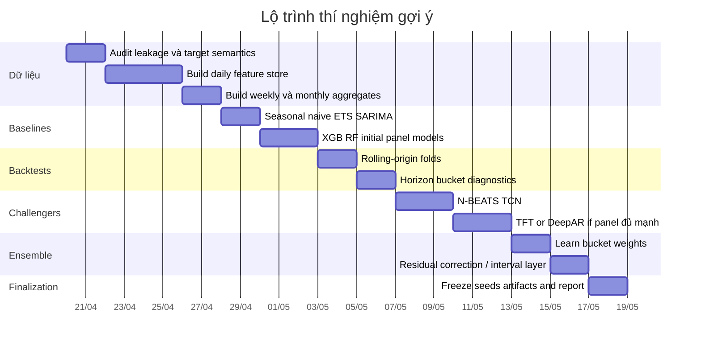

# Báo cáo nghiên cứu chuyên sâu về dự báo chuỗi thời gian tài chính Revenue và COGS

## Tóm tắt điều hành

Với chuỗi chỉ gồm `Date`, `Revenue`, `COGS` và lịch sử khoảng mười năm, bài toán của bạn nằm đúng ở giao điểm giữa **forecasting doanh thu bán lẻ**, **line-item financial forecasting** và **multi-horizon forecasting**. Trong văn liệu công khai, nghiên cứu đi thẳng vào dự báo **Revenue và COGS cùng lúc** không nhiều; nguồn gần nhất và có tính “đúng bài” nhất là Kesavan, Gaur và Raman, nơi tác giả mô hình hóa đồng thời sales, COGS, inventory và gross margin cho doanh nghiệp bán lẻ bằng hệ phương trình, cho thấy các line items này nên được dự báo **liên kết**, không nên xem như hai bài toán hoàn toàn độc lập. Trong khi đó, tổng quan bán lẻ của Fildes, Ma và Kolassa cho thấy retail forecasting thực chiến thường bị chi phối mạnh bởi seasonality, promotions, hierarchy, product/store aggregation và các biến ngoại sinh; còn systematic review về forecasting trong kế toán/tài chính của Kureljusic và Karger cho thấy hướng AI/ML đang tăng nhanh nhưng bằng chứng tốt nhất vẫn là những thiết kế so sánh cẩn thận với baseline thống kê mạnh. citeturn0search0turn13search10turn0search9

Nếu mục tiêu là **nâng cấp một lời giải top-7 hiện có**, tôi không xem “đổi sang Transformer” là bước nâng cấp có ROI cao nhất. Văn liệu dài hạn cho multi-step forecasting cho thấy deseasonalization, multiple-output/direct strategies, forecast combination, temporal aggregation và backtesting đúng cách thường mang lại lợi ích ổn định hơn là nhảy thẳng sang mô hình phức tạp; Ben Taieb và cộng sự chỉ ra multiple-output strategies thường mạnh trong multi-step forecasting, còn review về forecast combinations cho thấy blending vẫn là vũ khí rất bền vững. Đồng thời, bằng chứng gần đây cũng nhắc rằng Transformer không mặc nhiên thắng trên long-horizon time series; trong bài “Are Transformers Effective for Time Series Forecasting?”, các mô hình tuyến tính rất đơn giản còn vượt nhiều Transformer trên benchmark dài hạn. citeturn6search0turn6search4turn8search0

Khuyến nghị cốt lõi của tôi cho dữ liệu của bạn là: **giữ xương sống baseline thống kê + tree ensemble**, nhưng nâng cấp theo bốn trục. Thứ nhất, chuyển từ dự báo tách rời `Revenue` và `COGS` sang **dự báo có cấu trúc**: `Revenue`, `COGS_ratio = COGS / Revenue`, và `COGS_direct`, rồi blend. Thứ hai, thay một backtest đơn lẻ bằng **rolling-origin backtests theo horizon buckets** để học được model/weight khác nhau cho ngắn hạn, trung hạn và dài hạn. Thứ ba, bổ sung **temporal aggregation**: daily + weekly + monthly models, rồi reconcile/blend lại, vì long horizon thường được cải thiện khi nhìn ở tần suất thấp hơn. Thứ tư, nếu có bảng phụ, xây **feature store leakage-safe** cho promotions, orders, order_items, web/app traffic, category mix, returns, inventory lagged và calendar. Những khuyến nghị này phù hợp với evidence từ retail forecasting, cross-temporal hierarchies, multi-step literature và M5. citeturn13search10turn12search4turn6search0turn2search4turn2search5

Về lựa chọn mô hình, **ARIMA/SARIMA/ETS vẫn bắt buộc** làm baseline; **XGBoost** thường là “mô hình công việc” có ROI cao nhất nếu bạn có feature tốt; **Random Forest** hữu ích như baseline phi tuyến và để kiểm tra độ bền; **LSTM/GRU/TCN/N-BEATS/DeepAR/TFT** chỉ nên được dùng như challengers có kiểm soát, và chỉ thực sự đáng đầu tư mạnh khi bạn có panel/hierarchy hoặc nhiều covariates có cấu trúc tốt. AWS mô tả khá rõ rằng DeepAR+ phát huy khi có nhiều time series liên quan và covariates; còn TFT mạnh khi có static covariates và known-future inputs, đồng thời cho interpretability ở multi-horizon settings. citeturn1search7turn14search1turn4search0turn15search12turn23search0turn16search0turn3search3turn5search1turn3search6turn11search0turn24search0

Kết luận ngắn gọn: với một lời giải đã lên top-7, tôi kỳ vọng nâng cấp tốt nhất sẽ đến từ **feature engineering có kỷ luật**, **horizon-aware evaluation**, **blending theo bucket**, **target decomposition cho COGS**, và **multi-frequency reconciliation**. Deep learning có thể giúp, nhưng không nên là bước đầu tiên. Trong rất nhiều bối cảnh retail/sales, tree ensembles và hybrids vẫn cạnh tranh hoặc vượt deep models khi feature store đủ tốt và đánh giá đủ nghiêm ngặt. citeturn20search0turn12search1turn6search4

## Checklist nâng cấp ưu tiên

```markdown
- [ ] Dựng lại feature store theo ngày với tất cả bảng phụ, nhưng tách rõ `known_future` và `observed_past_only`.
- [ ] Thêm target decomposition: train `Revenue_direct`, `COGS_direct`, `COGS_ratio`, rồi blend `COGS`.
- [ ] Thay một backtest duy nhất bằng rolling-origin backtests nhiều mốc, có horizon buckets.
- [ ] Thêm branch weekly và monthly; forecast ở tần suất thấp rồi reconcile/blend về daily.
- [ ] Tối ưu blend theo bucket horizon thay vì một trọng số cố định cho toàn horizon.
- [ ] Thêm global/panel models theo category / channel / region / product mix nếu có thể tái tạo từ bảng phụ.
- [ ] Dùng leakage-safe lags cho returns, reviews, shipments, inventory; tuyệt đối không dùng contemporaneous future actuals.
- [ ] Chuẩn hóa calendar layer: DOW, week-of-year, month-end, quarter-end, payday, holiday, mega-sale windows, Tết-style effects.
- [ ] Thêm probabilistic layer: quantile XGBoost hoặc bootstrap residual intervals theo horizon bucket.
- [ ] Giữ baseline mạnh: seasonal naïve, ETS, SARIMA, XGB, RF trước khi thêm N-BEATS/TCN/TFT.
- [ ] Theo dõi metric theo từng bucket horizon, từng target, từng regime năm và từng mùa khuyến mãi.
- [ ] Lưu full OOF dự báo và residuals để học ensemble weights, residual correction và event correction.
```

Các TODO phía trên ưu tiên trực tiếp những gì văn liệu multi-step, retail forecasting và forecast combinations cho thấy có hiệu quả bền hơn so với chỉ đổi mô hình “ngầu” hơn. citeturn6search0turn13search10turn6search4turn21search0

## Giả định và bản đồ văn liệu

Tôi dùng các giả định sau vì đề bài không chỉ rõ cadence. Thứ nhất, tôi xét **hai nhánh song song**: nhánh **daily** nếu dữ liệu là ngày, và nhánh **monthly** nếu dữ liệu đã được tổng hợp theo tháng. Thứ hai, tôi giả định horizon “hai năm” nghĩa là **730 ngày** trong nhánh daily hoặc **24 tháng** trong nhánh monthly. Thứ ba, tôi giả định không có ràng buộc compute, nhưng vẫn ưu tiên **mô hình ROI cao** trước. Thứ tư, vì người dùng yêu cầu nâng cấp một lời giải top-7 hiện có, tôi ưu tiên các thay đổi có thể **cấy vào notebook hiện tại** hơn là viết lại toàn bộ hệ thống.

Trong văn liệu, có thể chia bốn lớp bằng chứng. Lớp một là **baseline thống kê**: ARIMA/SARIMA theo Hyndman–Khandakar và ETS theo state-space framework của Hyndman và cộng sự; MASE của Hyndman–Koehler là metric đặc biệt hữu ích vì ít lệ thuộc scale hơn MAPE. Lớp hai là **retail/sales forecasting literature**: review của Fildes–Ma–Kolassa, post-script sau COVID, các thực nghiệm aggregate retail sales của Alon; Chu–Zhang; Aye; và hybrid interval/quantile forecasting của Arunraj–Ahrens. Lớp ba là **deep/global models**: LSTM, GRU, TCN, N-BEATS, DeepAR, TFT. Lớp bốn là **evaluation & combination**: multi-step strategies của Ben Taieb, rolling-origin `tsCV`, validity note của Bergmeir–Hyndman–Koo, M4/M5, và review forecast combinations 2023. citeturn1search7turn14search1turn1search0turn13search10turn13search11turn19search1turn19search3turn0search2turn12search1turn23search0turn16search0turn3search3turn5search1turn3search6turn24search0turn6search0turn21search0turn21search5turn2search11turn2search4turn6search4

Điểm cần nói thẳng là **văn liệu trực tiếp về “forecast COGS như một target riêng” mỏng hơn rõ rệt** so với sales/revenue/demand forecasting. Đây là một suy luận tổng hợp từ systematic review về AI trong accounting forecasting, từ retail forecasting review, và từ việc bài gần chủ đề nhất đi thẳng vào COGS lại là Kesavan et al. 2010. Vì vậy, chiến lược thực dụng nhất là mượn tư duy từ retail demand forecasting và line-item financial forecasting thay vì chờ một corpus lớn riêng cho COGS. citeturn0search9turn13search10turn0search0

Nếu bạn muốn một cầu nối tiếng Việt, nguồn phù hợp nhất mà tôi tìm được là bài “Dự báo chuỗi thời gian với một số mô hình học máy và ứng dụng” của Đại học Cần Thơ. Bài này không thuộc domain retail/finance, nhưng hữu ích ở chỗ nó so sánh Holt-Winters, ARIMA, RF, GBM và AutoML trên dữ liệu dài 1992–2021, và kết luận GBM có thể vượt baseline cổ điển khi tuning đúng. Đây không phải bằng chứng domain-specific cho Revenue/COGS, nhưng là tài liệu tiếng Việt đáng đọc để tham khảo thiết kế thí nghiệm và tối ưu hóa mô hình. citeturn9search0turn9search24

Bảng dưới đây tóm tắt “bản đồ” các phương pháp chính trong bối cảnh của bạn.

| Nhóm | Đại diện | Khi nào nên ưu tiên | Điểm mạnh chính | Điểm yếu chính |
|---|---|---|---|---|
| Thống kê cổ điển | ARIMA, SARIMA, ETS | Một chuỗi đơn hoặc vài chuỗi, cadence monthly, cần baseline mạnh | Dễ giải thích, nhanh, tốt với trend/seasonality rõ | Yếu khi nhiều covariates, phi tuyến mạnh |
| Cây tăng cường / ensemble | XGBoost, RF, Extra Trees | Có feature store tốt, nhiều lags, calendar, promo, panel series | Rất mạnh thực chiến, robust, dễ blend | Phụ thuộc feature engineering |
| Deep learning chuỗi | LSTM, GRU, TCN, N-BEATS | Có nhiều series liên quan hoặc long context tốt | Học mẫu động phức tạp, mạnh với panel/global | Tuning khó hơn, dễ overfit nếu chỉ có 1–2 series |
| Deep probabilistic / multi-horizon | DeepAR, TFT | Có nhiều related series, static + known-future covariates | Forecast probabilistic, hỗ trợ covariates nhiều loại | Cần data organization tốt; compute cao |
| Hybrid / ensembles | SARIMAX+QR, model stacks, temporal aggregation | Top solution / leaderboard / production | Ổn định, giảm variance, mạnh ở long horizon | Quản trị pipeline phức tạp hơn |

Bảng này là tổng hợp từ papers gốc, review retail forecasting, AWS/Google official summaries và các benchmark liên quan. citeturn13search10turn14search1turn4search0turn15search12turn23search0turn16search0turn3search3turn5search1turn3search6turn11search0turn24search0

## Case studies và bằng chứng thực nghiệm

Trước khi vào bảng chi tiết, cần nhấn mạnh một thực tế khá quan trọng: **những nghiên cứu public có đủ cả ba yếu tố “gần retail/financial line items”, “lịch sử khoảng mười năm”, và “forecast horizon kéo dài nhiều quý/nhiều năm” là không nhiều**. Vì vậy, phần này được chia thành hai lớp: các nghiên cứu **rất gần bài toán** của bạn, và các nghiên cứu **gần theo cấu trúc** nhưng khác domain hoặc cadence. Với từng study, tôi chỉ ghi những chi tiết mà abstract/official summary nêu rõ; phần nào nguồn chính không nói, tôi ghi rõ “không nêu rõ”, thay vì suy đoán.

### Bảng case studies chi tiết

| Nghiên cứu | Domain và độ gần bài toán | Cadence và độ dài dữ liệu | Horizon | Thiết lập thực nghiệm | Tiền xử lý / covariates | Đánh giá | Kết quả / bài học chính | Nguồn |
|---|---|---|---|---|---|---|---|---|
| **Kesavan, Gaur, Raman (2010)** | Rất gần: sales, COGS, inventory, gross margin của retailer | Annual panel; dùng dữ liệu tài chính công khai và nonfinancial của retailer, không nêu rõ số năm trong snippet | Forward-looking line-item forecasts | Hệ phương trình đồng thời để forecast sales, COGS, inventory, gross margin | Kết hợp financial và nonfinancial drivers | So sánh với benchmark analyst/cơ sở cho line items | Chỉ ra các line items nên forecast **jointly**; đây là bằng chứng trực tiếp nhất ủng hộ việc không tách rời Revenue và COGS trong pipeline của bạn | citeturn0search0 |
| **Aye et al. (2015)** | Gần: aggregate retail sales | Monthly, 1970–2012 của South Africa | 12-, 24-, 36-step recursive OOS | So sánh 23 mô hình đơn và 3 tổ hợp forecast combination | Không nhấn mạnh covariates; trọng tâm là model comparison | Pseudo out-of-sample recursive forecasts; weighted loss | Không có mô hình đơn nào thống trị toàn bộ horizon; các tổ hợp dự báo cạnh tranh mạnh, đặc biệt khi horizon kéo dài | citeturn0search2 |
| **Alon, Qi, Sadowski (2001)** | Gần: aggregate retail sales | Monthly, US aggregate retail sales; dữ liệu dài nhiều năm nhưng snippet không nêu chính xác | Multiple-step forecasting | So sánh ANN với Winters, ARIMA và multivariate regression | Trend + seasonal patterns rõ; bài cho thấy ANN nắm bắt được nonlinearity | Out-of-sample multi-step comparison | ANN trung bình vượt các mô hình truyền thống; Winters vẫn là baseline mạnh khi kinh tế ổn định | citeturn19search1 |
| **Chu, Zhang (2003)** | Gần: aggregate retail sales | Seasonal retail sales; độ dài không nêu rõ trong snippet | Out-of-sample multi-step | So sánh mô hình tuyến tính và phi tuyến; neural networks là nonlinear approximators | Có kiểm tra deseasonalization; seasonal dummy và trigonometric terms | Multiple cross-validation samples | Nonlinear models vượt tuyến tính; **deseasonalization trước khi huấn luyện NN** cải thiện mạnh; trigonometric regression không hữu ích bằng kỳ vọng | citeturn19search3turn19search8 |
| **Arunraj, Ahrens (2015)** | Gần retail thực chiến, đặc biệt cho interval forecasts | Daily food sales của perishable retail item | Daily forecast; interval forecasting | Hybrid SARIMAX + linear regression/quantile regression | Dùng demand influencing factors; xử lý skewness/volatility | Point + interval forecast evaluation | Hữu ích trực tiếp cho COGS/Revenue khi bạn muốn thêm khoảng dự báo; hybrid cổ điển vẫn rất cạnh tranh trên dữ liệu retail biến động | citeturn12search1turn12search2 |
| **Punia, Singh, Madaan (2020)** | Gần về supply-chain/retail nhiều cấp và nhiều horizon | POS data của large multi-channel retailer; 141 time series | Từ short-term đến long-run aggregated forecasts | Cross-temporal forecasting framework với LSTM làm base forecaster; so sánh direct, temporal, cross-sectional, cross-temporal | Nhấn mạnh coherence qua product/location/time hierarchies | Nhiều metric + statistical tests | Forecasts coherent theo nhiều cấp và nhiều horizon tốt hơn direct forecasts; rất phù hợp với ý tưởng daily–weekly–monthly blending của bạn | citeturn12search4turn12search9 |
| **Nasseri et al. (2023)** | Gần retail data-engineering hiện đại | Daily demand cho hơn 330 sản phẩm, 76 tháng, 5.2M records | Tập trung đánh giá daily prediction; paper gợi mở kiểm tra horizon ngắn-trung-dài | So sánh ETR, XGBoost, RF, GBR với LSTM | Giá, promotions, calendar, weather, COVID features | MAPE, MAE, RMSE, R²; so theo 3 categories | Tree ensembles vượt LSTM trong case này; khác biệt đặc biệt lớn ở fresh meat. Đây là bằng chứng applied rất mạnh cho việc ưu tiên tree models khi feature store đủ tốt | citeturn20search0 |
| **LSEG StarMine SmartForecast (2026)** | Gần forecasting tài chính doanh nghiệp: FY1/FY2 revenue và earnings | Cross-sectional global universe ~50k public companies; point-in-time history | FY1 và FY2 | Two-stage ML non-linear framework, cập nhật khi có data mới | Fundamental data, market data, proprietary analytics; annual rồi disaggregate FY1 xuống quarterly bằng seasonality algorithm | Performance-tested nội bộ; point-in-time backtesting | Case applied rất quan trọng: với forecast revenue dài hạn, người chơi công nghiệp vẫn dùng **2-stage ML + seasonality disaggregation + point-in-time backtests** thay vì chỉ một mô hình end-to-end | citeturn17search12turn17search13 |
| **Chen et al. (2022)** | Gần theo line-item financial forecasting, không phải retail POS | Detailed financial data, high-dimensional XBRL tags | One-year-ahead earnings change direction | ML trên 4,627 detailed financial tags | High-dimensional detailed accounting features | Out-of-sample AUC; hedge returns | ML vượt logistic baselines và analyst forecasts; bài học then chốt là **độ chi tiết của line items** tạo khác biệt lớn — rất phù hợp với việc bạn khai thác sâu hơn product/category mix và cost structure cho COGS | citeturn18search5turn18search2 |

### Những gì rút ra được từ phần case studies

Bài học đầu tiên là **forecast dài hạn hiếm khi thắng bằng một mô hình duy nhất ở một tần suất duy nhất**. Aye cho thấy tổ hợp thường mạnh hơn mô hình đơn ở retail sales dài hạn; Punia cho thấy coherence theo hierarchy và temporal aggregation có giá trị; LSEG áp dụng đúng logic này trong bối cảnh industrial finance bằng 2-stage framework và disaggregation. Với một horizon hai năm, đây là lý do tôi xem **daily-only recursive model** là chưa đủ. citeturn0search2turn12search4turn17search13

Bài học thứ hai là **feature engineering và tiền xử lý vẫn quyết định thắng-thua**. Chu–Zhang và Ben Taieb đều củng cố vai trò của deseasonalization trong multi-step forecasting; study applied 2023 của Nasseri cho thấy chỉ cần feature tốt, tree ensembles có thể vượt LSTM khá rõ trong retail demand. Vì vậy, với top-7 solution, lợi nhuận biên cao hơn thường đến từ feature store và backtest design, không phải từ việc nhảy ngay sang architecture phức tạp. citeturn19search3turn6search0turn20search0

Bài học thứ ba là **Revenue và COGS nên được ràng buộc bằng cấu trúc kinh doanh**. Kesavan là bằng chứng trực tiếp nhất; Chen et al. củng cố ở phía accounting rằng detailed line items có giá trị dự báo cao. Trong thực nghiệm của bạn, điều này ủng hộ mạnh chiến lược dự báo `Revenue`, `COGS_direct`, `COGS_ratio` và thậm chí một vài driver trung gian như `units`, `AOV`, `discount_intensity`, `mix_cost_index`. citeturn0search0turn18search2

## Dữ liệu, đánh giá và độ bất định

Với dữ liệu chỉ có `Date`, `Revenue`, `COGS`, pipeline tối thiểu phải bắt đầu từ việc nhận diện **trend**, **seasonality**, **calendar effects**, **structural breaks** và **horizon-dependence của lỗi**. Review retail forecasting nhấn mạnh promotions và các yếu tố nhân quả làm tăng mạnh độ khó của bài toán; M5 cũng cho thấy hierarchy, price và promotions là các driver có sức nặng lớn trong retail forecasting. Nếu bạn có bảng phụ hoặc có thể tái tạo panel từ dữ liệu vi mô, đó thường là nguồn uplift quan trọng nhất. citeturn13search10turn2search4turn2search5

Một nguyên tắc thiết kế rất quan trọng là tách covariates thành hai loại. **Known-future inputs** là những thứ biết được tại thời điểm forecast: calendar, holiday, seasonality index, đôi khi là promo plan/price plan nếu doanh nghiệp đã chốt trước. **Observed-past-only inputs** là những thứ chỉ biết sau khi ngày đó xảy ra: realized web traffic, returns, reviews, shipments actual, conversion actual. AWS phân biệt rất rõ “historical related series” và “forward-looking related series”, còn TFT được thiết kế chính xác cho bối cảnh có static covariates, known future inputs và observed histories. Trong bài toán competition hoặc hidden future, đây là chỗ rất dễ gây leakage. citeturn11search1turn24search0

Nếu cadence là **monthly**, mười năm lịch sử chỉ cho bạn khoảng 120 điểm và horizon hai năm là 24 bước — đây là setting mà baseline thống kê mạnh, tree ensemble với lags 1/2/3/6/12/24, và temporal aggregation thường đáng tin hơn deep nets lớn. Nếu cadence là **daily**, bạn có khoảng 3,650 điểm, nhưng horizon 730 ngày lại rất dài; trong setting này, điều hợp lý là song song hóa **daily branch** cho ngắn hạn và **weekly/monthly branch** cho dài hạn, sau đó blend/reconcile theo bucket horizon. Lưu ý từ AWS về DeepAR+ là không nên đẩy forecast horizon quá lớn nếu data frequency quá mịn; khi muốn đi xa hơn trong tương lai, thường nên aggregate lên frequency cao hơn. citeturn11search0turn12search4

### Thiết kế feature cho Revenue và COGS

Về feature engineering, khung thực dụng nhất là chia thành bốn nhóm. Nhóm một là **calendar features**: day-of-week, week-of-year, month, quarter, month-end, quarter-end, holiday proximity, payday windows, school/opening/closing patterns nếu có. Nhóm hai là **autoregressive features**: lags, rolling means, rolling std, rolling max/min, seasonal lags, YoY deltas, cumulative-to-date positions. Nhóm ba là **causal/business features**: price, discount intensity, promotion depth, promo type, channel mix, traffic, order count, units, AOV, conversion proxies, returns, inventory, stockout proxies. Nhóm bốn là **hierarchical/aggregate features**: product-category-channel-region temporal sums và shares. Các review retail forecasting và DeepAR/TFT literature đều nhấn mạnh vai trò của related series và structured covariates. citeturn13search10turn11search0turn11search1turn24search0

Đối với `COGS`, tôi khuyến nghị đặc biệt thêm một nhánh **ratio / margin modeling**. `COGS` thường có phi tuyến khác `Revenue`, nhưng nhiều biến động của nó đến từ **mix**: mix sản phẩm, mix channel, mix promo, mix discount. Vì vậy, thay vì chỉ dự báo `COGS` trực tiếp, hãy dự báo thêm `COGS_ratio = COGS / max(Revenue, eps)` hoặc `gross_margin = 1 - COGS_ratio`, sau đó phục hồi `COGS_from_ratio = Revenue_pred * ratio_pred`. Về tư duy, điều này gần với line-item joint forecasting của Kesavan và phù hợp với cách LSEG disaggregate annual revenue forecasts bằng seasonality algorithm ở giai đoạn sau. citeturn0search0turn17search13

### Cross-validation và backtesting cho long horizon

Với horizon dài, cách chia train/valid một lần là quá yếu. Hyndman mô tả rolling forecasting origin trong `tsCV`, và Ben Taieb cho thấy đánh giá multi-step phải phản ánh đúng horizon quan tâm, không thể chỉ nhìn one-step performance. Đồng thời Bergmeir–Hyndman–Koo chỉ ra rằng K-fold CV chỉ nên dùng cẩn thận cho autoregressive setups nhất định; trong thực hành forecasting, rolling-origin/backtesting vẫn là lựa chọn mặc định an toàn hơn. citeturn21search0turn21search1turn6search0turn21search5

Tôi khuyến nghị ba lớp đánh giá. Lớp đầu là **global metrics** trên toàn horizon cho từng target: MAE, RMSE, MAPE hoặc sMAPE, và MASE. Lớp hai là **horizon-bucket metrics**, ví dụ với daily: 1–30, 31–90, 91–180, 181–365, 366–730; với monthly: 1–3, 4–6, 7–12, 13–24. Lớp ba là **regime/event diagnostics**: holiday windows, promo seasons, disrupted periods, high-volatility periods. MASE đặc biệt hữu ích khi so sánh giữa `Revenue` và `COGS` vì scale khác nhau và MAPE có thể méo nếu mẫu nhỏ gần zero. citeturn1search0turn21search0turn13search10

### Khoảng dự báo và forecast xác suất

Về uncertainty quantification, có bốn hướng phù hợp. Một là dùng prediction intervals từ ETS/ARIMA state-space. Hai là dùng **quantile regression** hoặc quantile objectives trong tree models; tài liệu XGBoost hiện hỗ trợ `reg:quantileerror`, ngoài `reg:tweedie` vốn hữu ích cho target dương lệch phải. Ba là dùng mô hình xác suất như DeepAR. Bốn là residual bootstrap/conformal-like wrappers trên OOF residuals theo bucket horizon. Với competition, lựa chọn nhanh và mạnh thường là **point-forecast ensemble + residual interval layer**. citeturn14search1turn10search0turn3search6

## Kế hoạch nâng cấp solution top-7

Dựa trên notebook và đề thi bạn đính kèm, tôi giả định lời giải hiện tại đã có một khung khá tốt: tree-based models, một số calendar/event features, recursive forecasting, và blend giữa vài baseline. Mục tiêu hợp lý lúc này không phải “làm mọi thứ khác đi”, mà là **giữ khung hiện tại và tăng sức mạnh ở những điểm lời giải leaderboard thường bỏ sót**.

### Những nâng cấp có ROI cao nhất

| Ưu tiên | Nâng cấp | Vì sao có ROI cao | Cách triển khai ngắn |
|---|---|---|---|
| Rất cao | **Target decomposition cho COGS** | COGS trực tiếp thường khó hơn doanh thu; ratio/margin giúp học mix tốt hơn | Train `Revenue_direct`, `COGS_direct`, `COGS_ratio`; blend ra `COGS_final` |
| Rất cao | **Horizon-bucket ensembling** | Model tốt cho 30 ngày đầu chưa chắc tốt cho 2 năm | Học weights riêng cho các bucket horizon bằng OOF |
| Rất cao | **Daily + weekly + monthly branches** | Long horizon ổn định hơn ở tần suất thấp | Forecast tuần/tháng, rồi reconcile/blend về ngày |
| Rất cao | **Feature store leakage-safe từ bảng phụ** | Uplift lớn nhất thường đến từ drivers, không phải kiến trúc | Merge orders, order_items, products, promotions, payments, returns, traffic, inventory lagged |
| Cao | **Panel/global models theo category/channel** | DeepAR/TFT/N-BEATS/TCN phát huy hơn với nhiều series liên quan | Tạo nhiều related series thay vì chỉ một chuỗi tổng |
| Cao | **Residual correction theo regime/event** | Event multipliers thủ công thường chưa ổn định | Học correction trên OOF residuals theo event × horizon |
| Cao | **Prediction intervals / quantiles** | Tăng ổn định ensemble và giúp chọn weights theo risk | XGB quantile hoặc bootstrap residual buckets |
| Trung bình | **Deep challengers có kiểm soát** | Chỉ đáng đầu tư sau khi feature + backtest đã vững | N-BEATS, TCN, TFT cho panel; không dùng Transformer thuần như “mặc định tốt hơn” |

Những nâng cấp này bám sát literature về combinations, multi-step forecasting, hierarchy và line-item forecasting. citeturn6search4turn6search0turn12search4turn0search0

### Các feature additions nên thêm ngay

Nếu bộ dữ liệu của bạn có các bảng phụ như trong competition đã gửi, tôi khuyến nghị thêm ít nhất các cụm feature sau:

**Doanh thu**
- `orders_count`, `paid_orders`, `units_sold`, `AOV`, `discount_rate`, `refund_amount_lag`
- `web_sessions_total`, `app_sessions_total`, `traffic_by_source_share`
- `promo_active_count`, `promo_depth_mean`, `promo_category_coverage`, `promo_channel_overlap`
- `returns_7d/28d`, `shipment_delay_7d/28d`, `review_count_lag`, `rating_lag`
- `channel mix`, `region mix`, `category revenue share`

**COGS**
- `weighted_product_cogs` từ `order_items × products.cogs`
- `category mix cost index`
- `inventory_lagged` features: previous month stock level, stockout flags, turnover proxies
- `returns_cost_proxy`
- `promo mix` và `discount mix` vì promotion có thể đổi product mix, từ đó đổi COGS ratio

**Lưu ý leakage cực quan trọng**
- Reviews, returns, shipments, inventory snapshots **chỉ dùng dưới dạng lag**.
- Nếu inventory là snapshot cuối tháng, chỉ dùng `prev_month_inventory_*`; không forward-fill snapshot cuối tháng vào toàn bộ tháng hiện tại.
- Nếu promotions/price plans tương lai **không có file future**, đừng dùng chúng như covariates tương lai thật; chỉ dùng lịch sử, seasonal templates hoặc forecast riêng cho promo intensity.
- Web traffic tương lai nếu không được cho sẵn phải là **driver forecast riêng** hoặc chỉ dùng lag histories.

Phân biệt này khớp với khung known-future vs observed-past-only trong DeepAR/TFT/AWS related time series. citeturn11search1turn24search0

### Model tweaks nên thử tiếp theo

Đối với XGBoost, đây là các range tôi khuyến nghị cho nhánh daily:

- `max_depth`: 4–10  
- `learning_rate`: 0.01–0.08  
- `min_child_weight`: 1–10  
- `subsample`: 0.6–1.0  
- `colsample_bytree`: 0.5–1.0  
- `n_estimators`: 500–4000 với early stopping  
- `reg_alpha`: 0–2  
- `reg_lambda`: 1–20  
- `objective`: thử `reg:squarederror`, `reg:tweedie`, và nếu muốn intervals thì `reg:quantileerror`  
- `tweedie_variance_power`: 1.1–1.8 cho target dương lệch phải  
- `device="cuda"` nếu có GPU; tree method dạng histogram/GPU để tăng tốc huấn luyện. citeturn10search0turn10search3turn10search7

Đối với nhánh monthly, giảm độ phức tạp đi đáng kể:
- `max_depth`: 2–6
- `learning_rate`: 0.02–0.10
- lags chính: 1, 2, 3, 6, 12, 24
- rolling windows: 3, 6, 12
- ưu tiên ETS/SARIMA/XGB trước deep nets

Đối với deep challengers:
- **N-BEATS**: stack 2–4 blocks, hidden width 128–512, lookback 2–8× horizon nếu cadence monthly; 90–365 ngày nếu daily, nhưng đừng quá dài nếu only one aggregate series. Paper gốc cho thấy N-BEATS vượt cả M4 winner trên benchmark của họ và còn có ưu điểm tương đối “gọn” về kiến trúc. citeturn5search1
- **TCN**: 4–8 residual blocks, kernel size 3–7, dilations theo lũy thừa 2. TCN thường ổn hơn LSTM khi cần receptive field dài và train song song tốt hơn. citeturn3search3
- **DeepAR**: chỉ ưu tiên nếu bạn tái cấu trúc dữ liệu thành nhiều related series; context length bắt đầu bằng forecast horizon là một khởi điểm hợp lý theo AWS docs. citeturn11search0
- **TFT**: chỉ đáng đầu tư khi bạn có static covariates + known future covariates hợp lệ; nếu không, chi phí mô hình hóa thường cao hơn lợi ích. citeturn24search0

### Thay đổi evaluation để phục vụ multi-year horizon

Nếu mục tiêu thật sự là forecast hai năm, tôi khuyến nghị đổi cách chấm nội bộ như sau:
- một score tổng cho toàn horizon,
- một score riêng cho từng bucket horizon,
- một score riêng cho `Revenue`,
- một score riêng cho `COGS`,
- và một score stability phạt mô hình có độ lệch lớn giữa các folds.

Lý do là M4/M5 và forecast-combination literature đều cho thấy tối ưu duy nhất cho “một score trung bình toàn horizon” dễ làm mô hình quá thiên về ngắn hạn. Với top solution, bạn thường thắng thêm bằng **ổn định hóa** hơn là tăng 0.1% ở đoạn đầu horizon. citeturn2search11turn2search4turn6search4

## Pipeline, pseudocode và siêu tham số

### Mermaid flowchart đề xuất



Thiết kế này bám rất sát những gì literature ủng hộ cho long-horizon retail forecasting: baseline mạnh, global models khi có panel, temporal aggregation, và combination ở tầng cuối. citeturn12search4turn6search4turn13search10

### Mermaid gantt đề xuất cho experiment phases



### Pseudocode cho feature extraction

```python
import pandas as pd
import numpy as np

def build_daily_feature_store(sales, orders, order_items, products,
                              promotions=None, payments=None, returns=None,
                              shipments=None, web_traffic=None, inventory=None):
    sales = sales.copy()
    sales["Date"] = pd.to_datetime(sales["Date"])
    daily = sales.sort_values("Date").set_index("Date")

    # Core calendar
    daily["dow"] = daily.index.dayofweek
    daily["dom"] = daily.index.day
    daily["month"] = daily.index.month
    daily["weekofyear"] = daily.index.isocalendar().week.astype(int)
    daily["quarter"] = daily.index.quarter
    daily["is_month_end"] = daily.index.is_month_end.astype(int)

    # Orders -> daily counts and AOV-like signals
    if orders is not None:
        orders = orders.copy()
        orders["order_date"] = pd.to_datetime(orders["order_date"])
        od = (orders
              .groupby("order_date")
              .agg(orders_count=("order_id", "nunique"),
                   customers_count=("customer_id", "nunique"),
                   gross_order_value=("total_amount", "sum"))
              .rename_axis("Date"))
        daily = daily.join(od, how="left")

    # Order items + product cost -> mix and implied cost proxies
    if order_items is not None and products is not None:
        order_items = order_items.copy()
        products = products.copy()
        orders_min = orders[["order_id", "order_date"]].copy()
        items = order_items.merge(products[["product_id", "category", "price", "cogs"]],
                                  on="product_id", how="left")
        items = items.merge(orders_min, on="order_id", how="left")
        items["order_date"] = pd.to_datetime(items["order_date"])
        items["line_cogs"] = items["quantity"] * items["cogs"]
        items["line_list_value"] = items["quantity"] * items["price"]
        iday = (items
                .groupby("order_date")
                .agg(units=("quantity", "sum"),
                     implied_cogs=("line_cogs", "sum"),
                     implied_list_value=("line_list_value", "sum"),
                     avg_discount=("discount", "mean"))
                .rename_axis("Date"))
        daily = daily.join(iday, how="left")

    # Promotions -> historical intensity only unless future plans are known
    if promotions is not None:
        promotions = promotions.copy()
        promotions["start_date"] = pd.to_datetime(promotions["start_date"])
        promotions["end_date"] = pd.to_datetime(promotions["end_date"])
        promo_days = []
        for _, r in promotions.iterrows():
            rng = pd.date_range(r["start_date"], r["end_date"], freq="D")
            tmp = pd.DataFrame({"Date": rng})
            tmp["promo_discount_pct"] = r.get("discount_pct", np.nan)
            tmp["promo_intensity"] = 1
            promo_days.append(tmp)
        if promo_days:
            promo_daily = (pd.concat(promo_days)
                           .groupby("Date")
                           .agg(promo_intensity=("promo_intensity", "sum"),
                                promo_discount_pct=("promo_discount_pct", "mean")))
            daily = daily.join(promo_daily, how="left")

    # IMPORTANT: lag everything that is not guaranteed known at forecast time
    past_only_cols = [c for c in daily.columns if c not in ["Revenue", "COGS"]]
    for col in past_only_cols:
        daily[f"{col}_lag1"] = daily[col].shift(1)
        daily[f"{col}_lag7"] = daily[col].shift(7)
        daily[f"{col}_lag28"] = daily[col].shift(28)
        daily[f"{col}_roll7"] = daily[col].shift(1).rolling(7).mean()
        daily[f"{col}_roll28"] = daily[col].shift(1).rolling(28).mean()

    return daily.reset_index()
```

### Pseudocode cho rolling-origin backtest và bucket metrics

```python
from dataclasses import dataclass

@dataclass
class FoldSpec:
    train_end: pd.Timestamp
    valid_start: pd.Timestamp
    valid_end: pd.Timestamp

def make_rolling_folds(dates, horizon, step, min_train_days):
    dates = pd.Series(pd.to_datetime(sorted(pd.unique(dates))))
    folds = []
    start_idx = min_train_days
    while start_idx + horizon < len(dates):
        train_end = dates.iloc[start_idx - 1]
        valid_start = dates.iloc[start_idx]
        valid_end = dates.iloc[start_idx + horizon - 1]
        folds.append(FoldSpec(train_end, valid_start, valid_end))
        start_idx += step
    return folds

def bucketize_horizon(h):
    if h <= 30: return "h_1_30"
    if h <= 90: return "h_31_90"
    if h <= 180: return "h_91_180"
    if h <= 365: return "h_181_365"
    return "h_366_plus"

def evaluate_multi_horizon(y_true, y_pred):
    err = y_true - y_pred
    out = {
        "mae": np.mean(np.abs(err)),
        "rmse": np.sqrt(np.mean(err ** 2)),
        "mape": np.mean(np.abs(err) / np.maximum(np.abs(y_true), 1e-6)),
    }
    return out
```

### Pseudocode cho horizon-bucket blending

```python
import numpy as np
import pandas as pd
from scipy.optimize import minimize

def fit_nonnegative_weights(oof_df, pred_cols, target_col):
    X = oof_df[pred_cols].values
    y = oof_df[target_col].values

    def loss(w):
        w = np.clip(w, 0, None)
        w = w / max(w.sum(), 1e-12)
        pred = X @ w
        return np.mean(np.abs(y - pred))  # MAE; đổi thành RMSE nếu muốn

    x0 = np.ones(len(pred_cols)) / len(pred_cols)
    cons = [{"type": "eq", "fun": lambda w: np.sum(w) - 1.0}]
    bnds = [(0.0, 1.0)] * len(pred_cols)
    res = minimize(loss, x0, method="SLSQP", bounds=bnds, constraints=cons)
    return pd.Series(res.x, index=pred_cols)

bucket_weights = {}
for bucket, dfb in oof_preds.groupby("horizon_bucket"):
    bucket_weights[bucket] = fit_nonnegative_weights(
        dfb,
        pred_cols=["pred_ets", "pred_sarima", "pred_xgb", "pred_weekly", "pred_monthly"],
        target_col="y"
    )
```

### Pseudocode cho multi-target training cho Revenue và COGS

```python
def make_targets(df):
    df = df.copy()
    eps = 1e-6
    df["cogs_ratio"] = df["COGS"] / np.maximum(df["Revenue"], eps)
    df["gross_margin"] = 1.0 - df["cogs_ratio"]
    return df

# Train three models:
# 1) Revenue_direct
# 2) COGS_direct
# 3) COGS_ratio
#
# Final COGS = alpha * COGS_direct + (1 - alpha) * Revenue_pred * COGS_ratio_pred

def reconstruct_cogs(revenue_pred, cogs_direct_pred, cogs_ratio_pred, alpha=0.5):
    cogs_from_ratio = revenue_pred * np.clip(cogs_ratio_pred, 0.0, 2.5)
    return alpha * cogs_direct_pred + (1 - alpha) * cogs_from_ratio
```

### Gợi ý siêu tham số theo mô hình

| Mô hình | Range khuyến nghị | Dữ liệu cần | Compute | Ghi chú |
|---|---|---|---|---|
| ETS | auto, additive/multiplicative seasonality | Thấp | Rất thấp | Baseline bắt buộc |
| SARIMA / SARIMAX | `p,q` 0–3; `P,Q` 0–2; seasonal period 7/12/365 tùy cadence | Thấp–vừa | Thấp | Dùng tốt cho monthly hoặc daily aggregated |
| RF | `n_estimators` 300–1500; `max_depth` 6–20 | Vừa | Thấp–vừa | Baseline ML robust |
| XGBoost | như bảng phía trên | Vừa–cao | Vừa | ROI cao nhất khi feature tốt |
| LSTM / GRU | hidden 64–256; layers 1–3; dropout 0.0–0.3 | Cao hơn | Vừa–cao | Chỉ là challenger nếu ít series |
| TCN | channels 32–128; kernel 3–7; blocks 4–8 | Vừa–cao | Vừa | Hay ổn hơn RNN khi context dài |
| N-BEATS | width 128–512; stacks 2–4 | Vừa–cao | Vừa–cao | Base deep challenger cho univariate/multivariate nhẹ |
| DeepAR | context ≈ horizon; lag structure theo cadence | Cao và nhiều series | Cao | Rất hợp panel/hierarchy |
| TFT | hidden 32–128; attention heads 2–8; dropout 0.05–0.3 | Cao, cần covariates rõ | Rất cao | Chỉ nên chạy khi có known future inputs đúng nghĩa |

Bảng này là tổng hợp thực hành dựa trên papers gốc và official docs, nhất là XGBoost, DeepAR và TFT. citeturn10search0turn10search3turn11search0turn24search0turn5search1turn3search3

## Tài liệu cốt lõi cần đọc

Nếu bạn muốn đọc đúng những tài liệu “đáng tiền” nhất cho bài toán này, tôi sẽ ưu tiên theo thứ tự sau.

- **Kesavan, Gaur, Raman (2010)** về simultaneous forecasting sales, COGS, inventory, gross margin trong retail. Đây là tài liệu sát Revenue–COGS nhất. citeturn0search0
- **Fildes, Ma, Kolassa (2022)** *Retail forecasting: Research and practice* và post-script 2022. Đây là review tốt nhất để đặt bài toán retail forecasting vào bối cảnh đúng. citeturn13search10turn13search11
- **Ben Taieb et al. (2012)** về chiến lược multi-step ahead forecasting. Cần đọc nếu bạn forecast 2 năm thay vì 1 bước. citeturn6search0turn6search1
- **Hyndman & Khandakar (2008)** cho ARIMA tự động; **Hyndman et al. (2002)** cho ETS state-space; **Hyndman & Koehler (2006)** cho MASE. Đây là bộ khung baseline/evaluation bắt buộc. citeturn1search7turn14search1turn1search0
- **Aye et al. (2015)** cho aggregate retail sales dài hạn và forecast combinations. Rất gần bài toán horizon dài. citeturn0search2
- **Arunraj & Ahrens (2015)** cho hybrid SARIMAX + quantile regression trong retail food sales. Hữu ích nếu bạn muốn thêm intervals. citeturn12search1
- **Punia et al. (2020)** về cross-temporal hierarchical forecasting cho retail supply chain. Rất hợp ý tưởng daily/weekly/monthly blend. citeturn12search4turn12search9
- **N-BEATS**, **DeepAR**, **TFT** lần lượt cho deep univariate/global, probabilistic related series, và interpretable multi-horizon forecasting. citeturn5search1turn3search6turn24search0
- **Review forecast combinations 2023** nếu bạn đang ở top-7 và cần bứt lên bằng ensemble tốt hơn. citeturn6search4
- **XGBoost docs** cho `reg:tweedie`, `reg:quantileerror`, GPU support, vì đây là phần triển khai rất thực dụng cho notebook hiện tại. citeturn10search0turn10search7

Trên cùng mặt bằng bằng chứng hiện có, khuyến nghị cuối cùng của tôi là: **đừng thay cả pipeline; hãy nâng cấp theo cấu trúc**. Cụ thể, hãy thêm feature store leakage-safe, temporal aggregation, horizon-bucket blending, và target decomposition cho COGS trước. Chỉ sau khi bốn lớp đó đã ổn, mới đáng đầu tư sâu vào N-BEATS/TCN/TFT. Đây là con đường có xác suất cao nhất để biến một lời giải top-7 thành một lời giải cạnh tranh hơn cho horizon hai năm. citeturn13search10turn6search4turn12search4turn0search0turn20search0